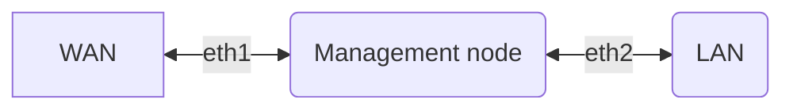

## Description
Talos linux k8s lab with pxe boot using dnsmasq and matchbox.
## Prepare
Lab scheme:

### management VM
On management VM install docker, enable ip forwarding and nat for internal network. Select hostname,fqdn and lan ip for management node (matchbox.test.local in this example).

### cluster VMs
Create VMs for cluster roles. [System reqs](https://www.talos.dev/v1.9/introduction/system-requirements/). In this readme we will use 3 control plane VMs and 3 workers. Write down MAC addresses of those VMs.

### dnsmasq
Start dnsmasq docker container on management node. Change network range, IPs, and MAC addresses as you want.
```bash
docker run --rm --cap-add=NET_ADMIN --net=host dnsmasq:0.0.1 \
  -d -q \
  --dhcp-range=#STARTIP#,#ENDIP# \
  --dhcp-option=option:ntp-server,10.0.0.1 \
  --enable-tftp --tftp-root=/var/lib/tftpboot \
  --dhcp-match=set:bios,option:client-arch,0 \
  --dhcp-boot=tag:bios,undionly.kpxe \
  --dhcp-match=set:efi32,option:client-arch,6 \
  --dhcp-boot=tag:efi32,ipxe.efi \
  --dhcp-match=set:efibc,option:client-arch,7 \
  --dhcp-boot=tag:efibc,ipxe.efi \
  --dhcp-match=set:efi64,option:client-arch,9 \
  --dhcp-boot=tag:efi64,ipxe.efi \
  --dhcp-userclass=set:ipxe,iPXE \
  --dhcp-boot=tag:ipxe,http://matchbox.test.local:8080/boot.ipxe.0 \
  --dhcp-host=#MAC1#,#CPNODEIP1# \
  --dhcp-host=#MAC2#,#CPNODEIP2# \
  --dhcp-host=#MAC3#,#CPNODEIP3# \
  --dhcp-host=#MAC5#,#WORKERNODEIP1# \
  --dhcp-host=#MAC6#,#WORKERNODEIP1# \
  --dhcp-host=#MAC7#,#WORKERNODEIP1# \
  --address=/matchbox.test.local/#MANAGEMENTNODEIP# \
  --log-queries \
  --log-dhcp
```

### talos
1. Read [docs](https://www.talos.dev/v1.9/introduction/prodnotes/)
2. This guide uses 3 control plane node with VIP (patch-network-vip.yaml). [About patches](https://www.talos.dev/v1.9/talos-guides/configuration/patching/#configuration-patching-with-talosctl-cli)
3. Cluster example:
```
$ talosctl gen config mycluster https://##VIP##:6443
generating PKI and tokens
created /Users/taloswork/controlplane.yaml
created /Users/taloswork/worker.yaml
created /Users/taloswork/talosconfig
``` 
4. controlplane and worker yaml files(afer apply requred patches) you need to copy in matchbox assets folder. Read guide below.

### matchbox
Create ```/var/lib/matchbox/{assets,profiles,groups}``` folders.

Follow [this](https://www.talos.dev/v1.9/talos-guides/install/bare-metal-platforms/matchbox/#create-the-matchbox-configuration-files) guide to create requred matchbox files. You must name your profile json file with the same name as profile have in json.

At the end you will have something like this:
```
/var/lib/matchbox/assets:
    controlplane.yaml
    initramfs.xz
    vmlinuz
    worker.yaml

/var/lib/matchbox/groups:
    cp1.json
    cp2.json
    cp3.json
    default.json

/var/lib/matchbox/profiles:
    control-plane.json
    default.json
```

Start matchbox docker container on management node
```bash
docker run --net=host \
    --detach --restart always \
    --name matchbox \
    -v /var/lib/matchbox:/var/lib/matchbox:Z \
    -v /etc/matchbox:/etc/matchbox:Z,ro quay.io/poseidon/matchbox:v0.10.0 \
    -address=0.0.0.0:8080 -log-level=debug
```
## Start
1. power on control plane nodes. Wait for pxe boot, instaling and restart.
2. [run bootstrap command on one node](https://www.talos.dev/v1.9/introduction/getting-started/#kubernetes-bootstrap)
3. wait for control plane sync. power on worker nodes.
4. You have k8s cluster lab.